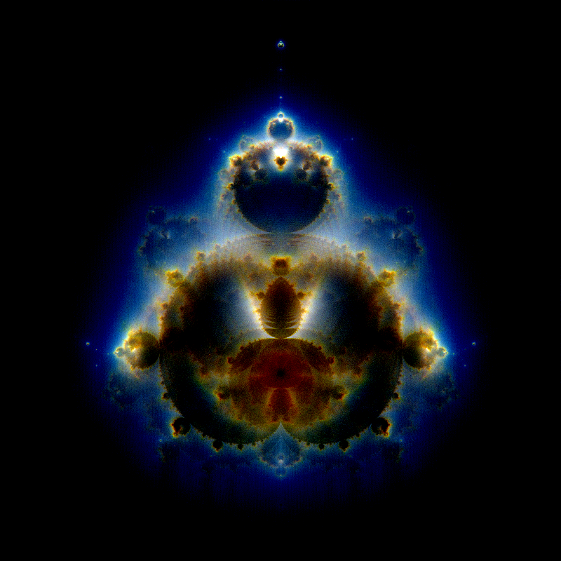
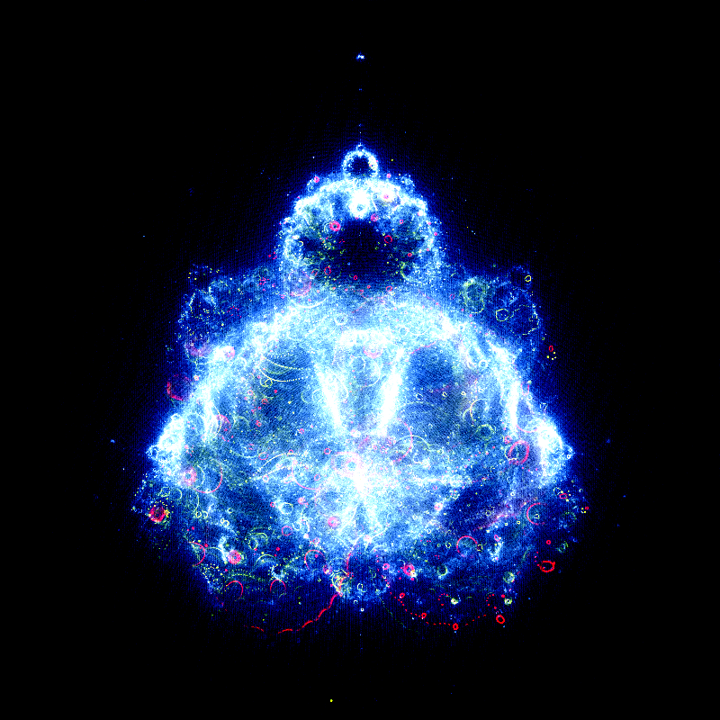
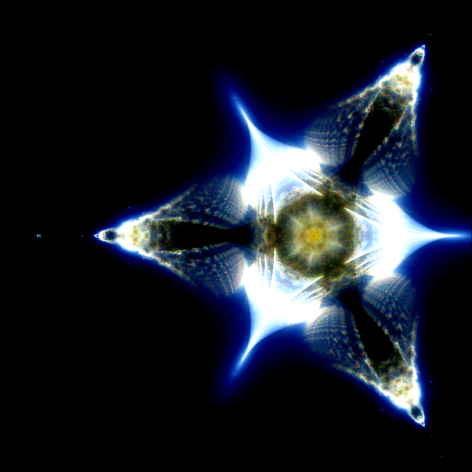
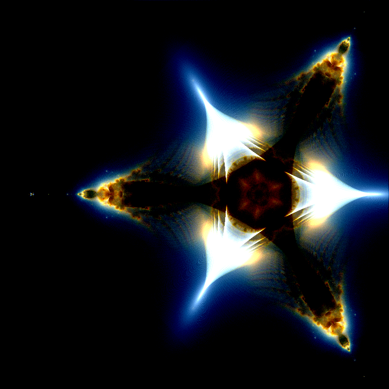
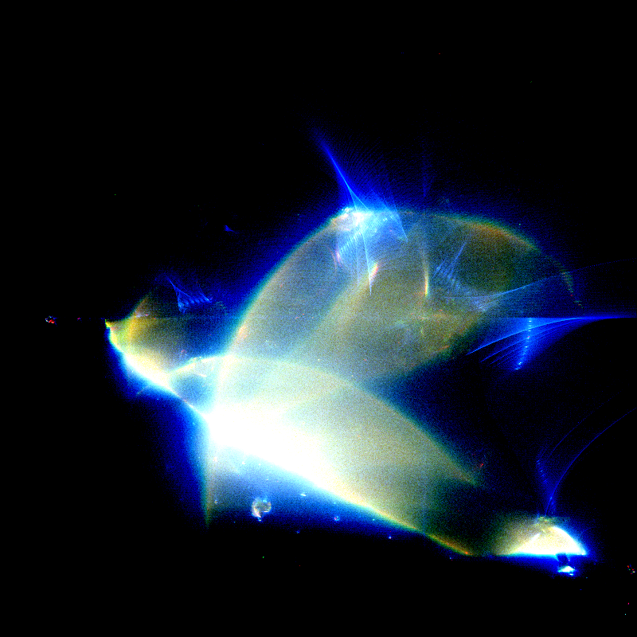
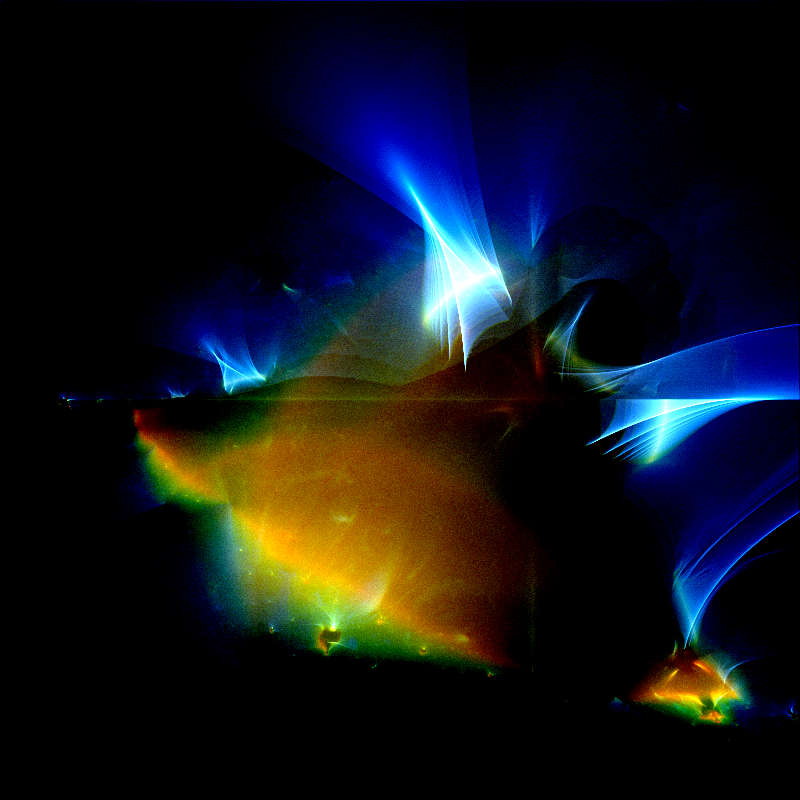

This project is currently a work-in-progress, but in the future I plan to extend these two-dimensional representations of the Buddhabrot set into the 3rd and 4th dimensions. All the code is in Python.
Requirements to run:
numpy, taichi, pillow, and opencv-python (optional)

This repository includes code to render the Mandelbrot set and its extensions (tricorn and burning ship fractals), as well as the buddhabrot versions of each.
Run mandelbrot.py to render the Mandelbrot set and try uncommenting certain lines to create the other fractals. Run buddhabrot.py to render the Buddhabrot, and you can also uncomment lines here to see the other fractals. Be patient with the Buddhabrot since it can take a while to render the image with a high number of random points and iterations.
If you want to denoise an image that you render, open denoise.py and change the input and output file names and tweak the settings to your liking before running it to get a denoised version of your render.

Here are some output images I have gotten:

Buddhabrot with iterations of R=20000, B=2000, G=500

Buddhabrot with iterations of R=800, B=200, G=50

Tricorn with iterations of R=20000, B=2000, G=500

Tricorn with iterations of R=800, B=200, G=50

Burning ship with iterations of R=20000, B=2000, G=500

Burning ship with iterations of R=800, B=200, G=50
